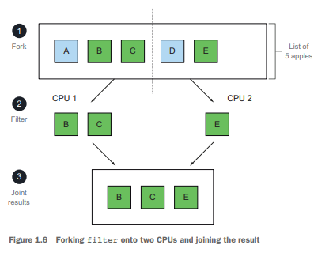

**Streams**

Supports many paralell operations to process data and it's like a declarative language (don't give instructions on how to process the data)
This streams are mainly used for avoid the use of synchronized (Multithread code)

**Behavior Parameterization**

This allows to pass code as parameters, so if you have two methods that just differ in couple lines of code the method could receive the code that differs
as parameters

**Stream**
Sequence of data items that are conceptually produced one at a timme

```java
import java.util.ArrayList;

List<String> animals = new ArrayList<>();
List<String> mammals = animals.stream().filter(animal -> animal.getType() == "mammal");
```
**Fist class values** -> Values that could be passed around during program execution

**Lambdas** -> Functions as values (anonymous functions)

```java
filterApples(inventory, (Apple a) -> GREEN.equals(a.getColor()));
```

** Predicate ** -> Takes a value for an argument and returns true or false
```java
public interface Predicate<T>{
 boolean test(T t);
}
```

**Stream API** -> Provides a different way to process data in comparison to the collections API
Streams -> Internal Iteration
Collections -> External Iteration

**Forking step**
Like filter one half of a list in one thread and the other half in another thread


